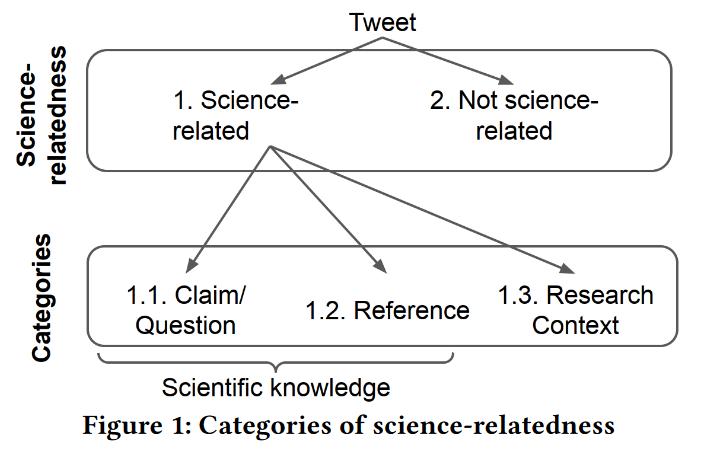

# SciTweets Heuristics - Heuristics of Science-Relatedness of Tweets

## Description

This method offers a computationally inexpensive way to extract scientific online discourse from a dataset of social media posts. It contains heuristics to identify three different forms of science-relatedness in tweets i.e., 1) if it has a claim, if the claims is scientific and the sentence having the claim 2) whether the claim about a scientific magazine or news article and 3) the scientist or research method mentioned in the claim. The heuristics are developed for the SciTweets dataset as part of the publication *"SciTweets - A Dataset and Annotation Framework for Detecting Scientific Online Discourse"* published at **CIKM2022**.

## Use Cases

Study online science-related discourse to explore if the social media post has scientific claims, science-related terms, belongs to scientific magazines or news articles, and has scientists or research method mentions. 

## Input Data

Sample input for the method is in file [data/example_tweets.tsv](data/example_tweets.tsv)

| tweetid            | text                                                                                                                                       | urls                                                         |
|--------------------|:-------------------------------------------------------------------------------------------------------------------------------------------|--------------------------------------------------------------|
| 714752339819757568 | In @sciencemagazine: Rare variant found that raises HDL cholesterol and increases risk of coronary heart disease: https://t.co/4xpL3KlGy9  | ['https://www.science.org/doi/full/10.1126/science.aad3517'] |
| 361218917303193600 | Teach children to treat animals responsibly do not teach captivity! Join us http://t.co/UR15gQPatU #FreeAllCetacea via @FreeAllCetacea     | ['http://www.wdcs.org/']                                     |
| 712710761240350720 | Violence is a leading cause of death for Americans 10-24 yrs old. @NICHD_NIH research on youth violence prevention https://t.co/9ZD58zGUhI | ['https://1.usa.gov/1q0MqOd/']                               |

*Please note that in order for the tweets/social media posts to be annotated with the heuristics of categories 1.1 and 1.3, the dataset must include a text column that allows the application of the corresponding heuristics. While, to be annotated with the heuristics of the category 1.2, the dataset must contain the urls column for the url related heuristics.*

*The columns from the input file are moved as is to the output files.*

## Output Data
The extracted heuristics are written into the files [data/example_tweets_cat1_heuristics.tsv](data/example_tweets_cat1_heuristics.tsv), [data/example_tweets_cat2_heuristics.tsv](data/example_tweets_cat2_heuristics.tsv), and [data/example_tweets_cat3_heuristics.tsv](data/example_tweets_cat3_heuristics.tsv). 

As an example, [data/example_tweets_cat2_heuristics.tsv](data/example_tweets_cat2_heuristics.tsv) file is shown: 

| tweetid            | text                                                                                                                                       | urls                                                         | sci_subdomain   | has_sci_subdomain | sci_mag_domain  | has_sci_mag_domain | sci_news_domain | has_sci_news_domain | is_cat2 |
|--------------------|:-------------------------------------------------------------------------------------------------------------------------------------------|--------------------------------------------------------------|-----------------|-------------------|-----------------|--------------------|-----------------|---------------------|---------|
| 714752339819757568 | In @sciencemagazine: Rare variant found that raises HDL cholesterol and increases risk of coronary heart disease: https://t.co/4xpL3KlGy9  | ['https://www.science.org/doi/full/10.1126/science.aad3517'] | www.science.org | True              | www.science.org | True               |                 | False               | True    |
| 361218917303193600 | Teach children to treat animals responsibly do not teach captivity! Join us http://t.co/UR15gQPatU #FreeAllCetacea via @FreeAllCetacea     | ['http://www.wdcs.org/']                                     |                 | False             |                 | False              |                 | False               | False   |
| 712710761240350720 | Violence is a leading cause of death for Americans 10-24 yrs old. @NICHD_NIH research on youth violence prevention https://t.co/9ZD58zGUhI | ['https://1.usa.gov/1q0MqOd/']                               |                 | False             |                 | False              |                 | False               | False   |

## Hardware Requirements
The method runs on a small virtual machine provided by cloud computing company (2 x86 CPU cores, 4 GB RAM, 40GB HDD).

## Environment Setup

Run the following commands to set up the virtual environment and download resources. *The method works with Python version>=3.9*.

- `python -m pip install -r requirements.txt`
- `python -m spacy download en_core_web_sm`

## How to Use

**Run the scripts for category 1.1**

`python3 heuristics/cat1_sciknowledge.py data/example_tweets.tsv`

**Run the scripts for category 1.2**

`python3 heuristics/cat2_sciurl.py data/example_tweets.tsv`

**Run the scripts for category 1.3**

`python3 heuristics/cat3_research.py data/example_tweets.tsv`

## Technical Details

**Category 1 - Science-related**: Texts that fall under at least one of the following categories:

- **Category 1.1 - Scientific knowledge (scientifically verifiable claims):** Does the text include a claim or a question that could be scientifically verified? 

    **Heuristics for Category 1.1:** To find tweets for category 1.1, the final heuristic comprises two heuristics combined with a logical AND operator:
    - Heuristic 1: pattern-matching for subject-predicate-object patterns (more specifically: noun-verb-noun and noun-verb-adjective patterns) where the predicate must come from a list of predefined predicates (e.g, « cause », « lead to », « help with ») that we extracted from different research works on claims [1-4].
    - Heuristic 2: scientific term filter where we only keep tweets that contain at least one term from a predefined list of ~30k scientific terms that come from Wikipedia Glossaries, from which we hand-picked the categories that we deemed to be related to science (e.g, « medicine », « history », « biology »).

- **Category 1.2 - Reference to scientific knowledge:** Does the text include at least one reference to scientific knowledge? References can either be direct, e.g., DOI, title of a paper, or indirect, e.g., a link to an article that includes a direct reference

    **Heuristics for Category 1.2:** To find tweets for category 1.2, the heuristic checks whether a tweet contains a URL with a subdomain that is included in a
predefined list of 17,500 scientific domains and subdomains from open access repositories, newspaper science sections, and science magazines (e.g., “link.springer.com“, “sciencedaily.com“).

    Number of scientific domains and subdomains per type:

    | Type                       | Number of domains and subdomains |
    |----------------------------|:--------------------------------:|
    | Open Access Repositories   |              17,463              |
    | Newspaper Science Sections |                23                |
    | Science Magazines          |                14                |
    | Total                      |              17,500              |

    *Open Access Repositories*

    The list of 17,463 subdomains is collected as follows:
    - All full-text links included in the public CrossRef Snapshot from January 2021 ([Link](https://academictorrents.com/details/e4287cb7619999709f6e9db5c359dda17e93d515)) were extracted
    - Using the CrossRef API, we extracted the full-text links that were registered after January 2021
    - All extracted links were annotated with their subdomain using the Python library [tldextract](https://github.com/john-kurkowski/tldextract)
    - The frequency for every subdomain was computed  
    - We excluded subdomains with a frequency lower than 50
    - We excluded 38 subdomains that are not scientific (e.g., "youtube.com", "yahoo.com")
    - We added 46 subdomains from a manually curated list (e.g., "semanticscholar.org", "www.biorxiv.org")

    To filter tweets that refer to Open Access Repositories, the tweets must contain a URL with a subdomain from this list. 

    *Newspaper Science Sections*

    The list of 23 Newspaper Science Sections is manually curated and contains domains from major newspaper outlets in the English language that have a dedicated science section.
    To filter tweets that refer to Newspaper Science Sections, the tweets must contain a URL with a subdomain from this list **AND** include "/science".

    *Science Magazines*

    The list of 14 Science Magazines domains and subdomains is manually curated.
    To filter tweets that refer to Science Magazines, the tweets must contain a URL with a subdomain from this list.

- **Category 1.3 - Related to scientific research in general:** Does the text mention a scientific research context (e.g., mention of a scientist, scientific research efforts, research findings)?

  **Heuristics for Category 1.3:** To find tweets for category 1.3, four different heuristics are combined with a logical OR operator:
  - Heuristic 1: includes tweets that mention scientists, i.e., that have a noun from a predefined list, e.g., "research team", "research group", "scientist", "researcher", "psychologist", "biologist", "economist"
  - Heuristic 2: includes tweets that mention research, i.e., that have a noun from a predefined list, e.g., 'research on', 'research in', 'research for', 'research from', 'science of', 'science to', 'science', 'sciences of'
  - Heuristic 3: tweets that mention a research method, i.e., that have a word from a predefined list of social science methods, collected from SAGE Social Science Thesaurus (see sc_methods.txt) [Link](https://concepts.sagepub.com/vocabularies/social-science/en/page/?uri=https%3A%2F%2Fconcepts.sagepub.com%2Fsocial-science%2Fconcept%2Fconceptgroup%2Fmethods)
  - Heuristic 4: includes tweets that mention research outcomes, i.e., that have a noun from a predefined list, e.g.,'publications', 'posters', 'reports', 'statistics', 'datasets', 'findings'

**Category 2 - Not science-related**: Texts that do not fall under any of the three subcategories of category 1, i.e., science-relatedness. 

 
## References
[1] Pinto, J. M. G., Wawrzinek, J., & Balke, W. T. (2019, June). What Drives Research Efforts? Find Scientific Claims that Count!. In 2019 ACM/IEEE Joint Conference on Digital Libraries (JCDL) (pp. 217-226). IEEE.

[2] González Pinto, J. M., & Balke, W. T. (2018, September). Scientific claims characterization for claim-based analysis in digital libraries. In International Conference on Theory and Practice of Digital Libraries (pp. 257-269). Springer, Cham.

[3] Kilicoglu, H., Rosemblat, G., Fiszman, M., & Rindflesch, T. C. (2011). Constructing a semantic predication gold standard from the biomedical literature. BMC bioinformatics, 12(1), 1-17.

[4] Smeros, P., Castillo, C., & Aberer, K. (2021, October). SciClops: Detecting and Contextualizing Scientific Claims for Assisting Manual Fact-Checking. In Proceedings of the 30th ACM International Conference on Information & Knowledge Management (pp. 1692-1702).

## Contact Details
For questions or feedback, contact <sebastian.schellhammer@gesis.org>
